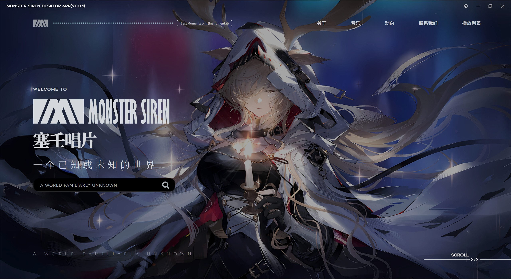
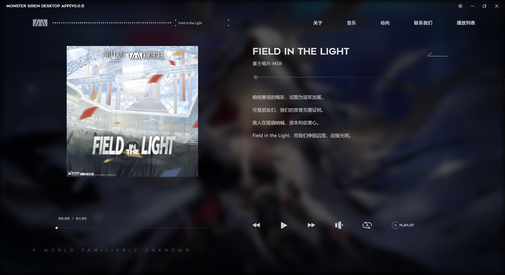
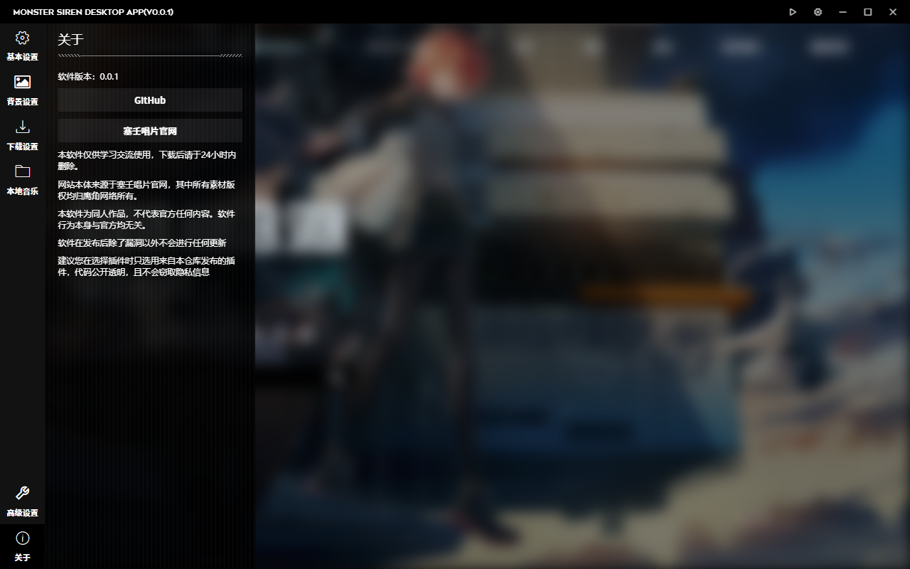
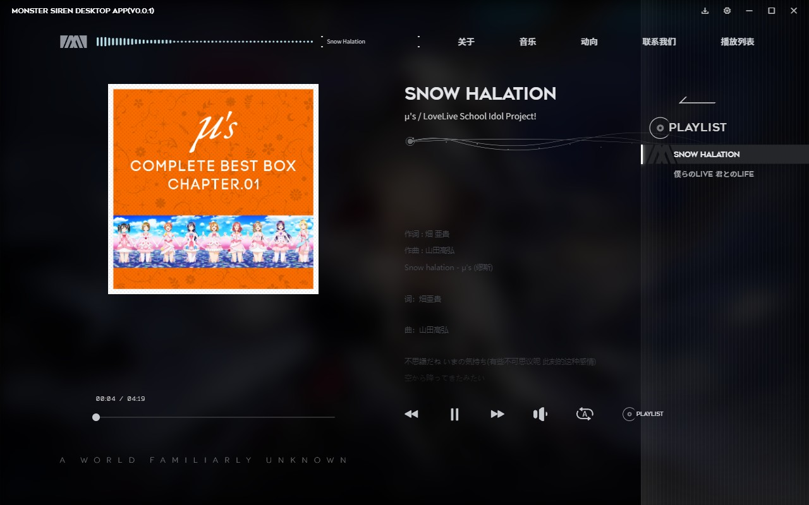
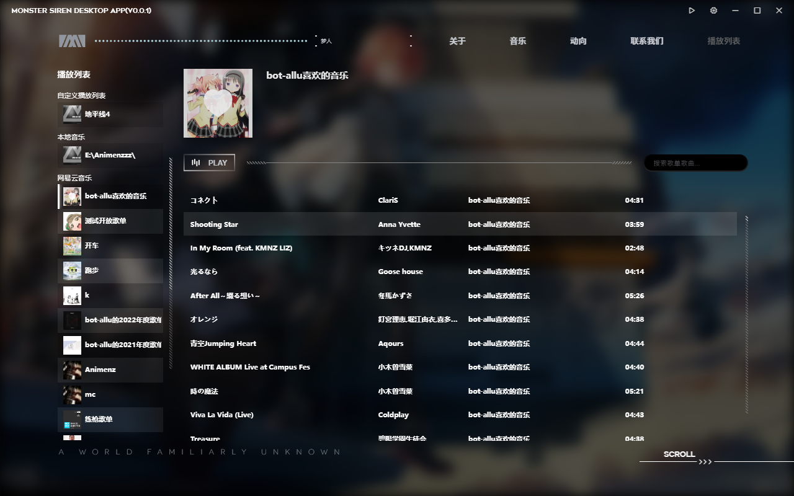
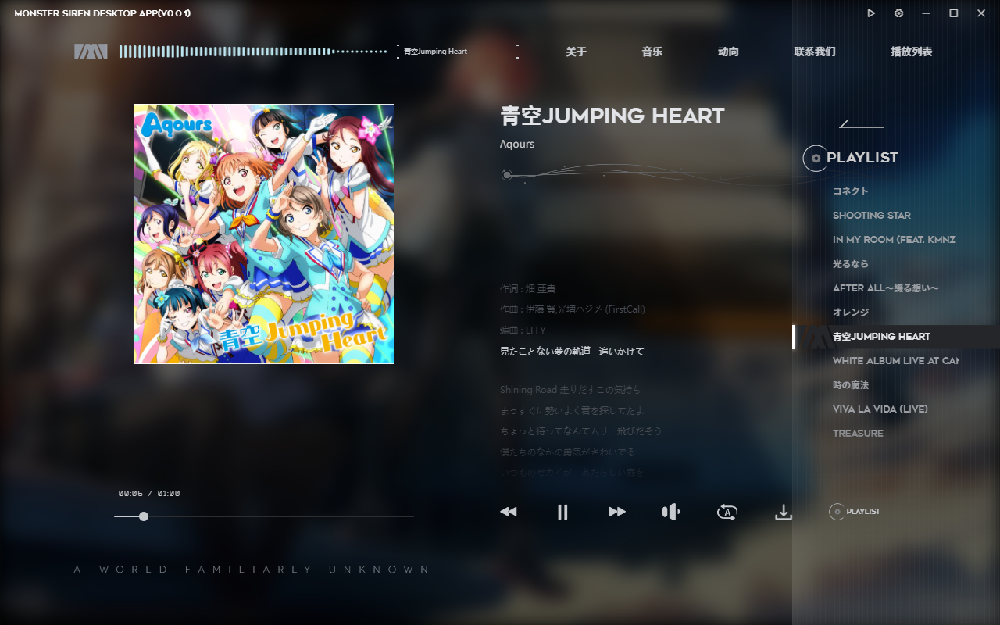
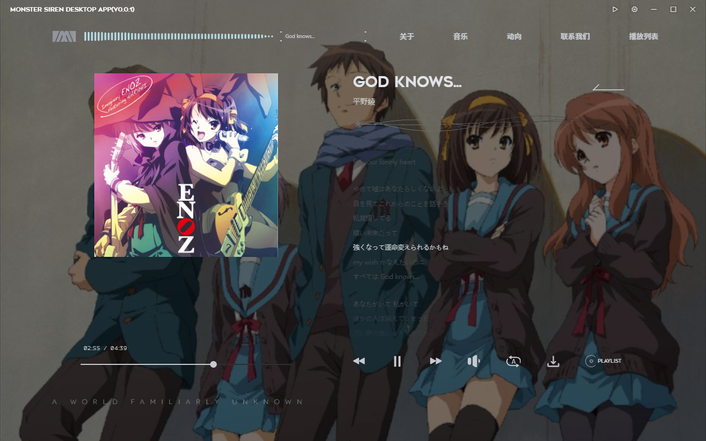

# Monster Siren Desktop

## 介绍

塞壬唱片桌面版 + 功能增强

**注：这只是一个同人作品，不代表官方任何内容**

项目大部分预期功能均已完成，接下来就是撰写文档与使用手册，可以查看下方列表了解已完成功能的信息：

- [x] 背景图切换
- [x] 能够读取本地歌曲进行播放
- [ ] 能够下载网站内的音频 - 用内置下载 api 可以完成，但是不够美观和优雅
- [ ] 桌面歌词
  - 感觉不可能了（恼
- [x] 具备接入第三方音乐平台的机制
  - [x] 网易云接入 - 可用，偶尔会导致软件出现运行时错误崩溃，个别情况会出现 `song/url` 返回 -105 的问题导致歌曲无法播放
- [x] 具备离线访问功能
  - 采用网站爬取 + 内联实现缓存，大小在14MB左右
- [x] 本地播放列表，但是可以展示多平台音乐
  - 有点小bug，但是基本使用是可以了

目前代码还不是那么规范，很多地方写的还是一坨，将就着吧，假如真要搞的话直接开2.0版本了（恼

## 发起 pr

pr 发起请向 dev 分支发起。

## 一些截图

