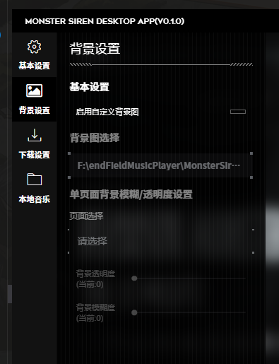

点击右上角设置按钮，可以见到更换网站背景图的选项

开启自定义背景功能后，背景会变为黑色，此时你可以选择一张来自本地文件的图片

建议先选择一张背景较暗的图片，假如图片太亮会导致一些按钮与文字看不清，影响使用体验

### 调整亮度与模糊

针对每个页面都有两个选项：`背景透明度` 与 `背景模糊度`

透明度值越高，背景越亮。模糊度同理

个人建议如果页面文字较多，请把透明度降低，其次是提升模糊度，这样在使用时可以更专注于文字的阅读

每个选项都有一个建议值，如果不知道怎么设置可以先从建议值开始，然后再慢慢调整
