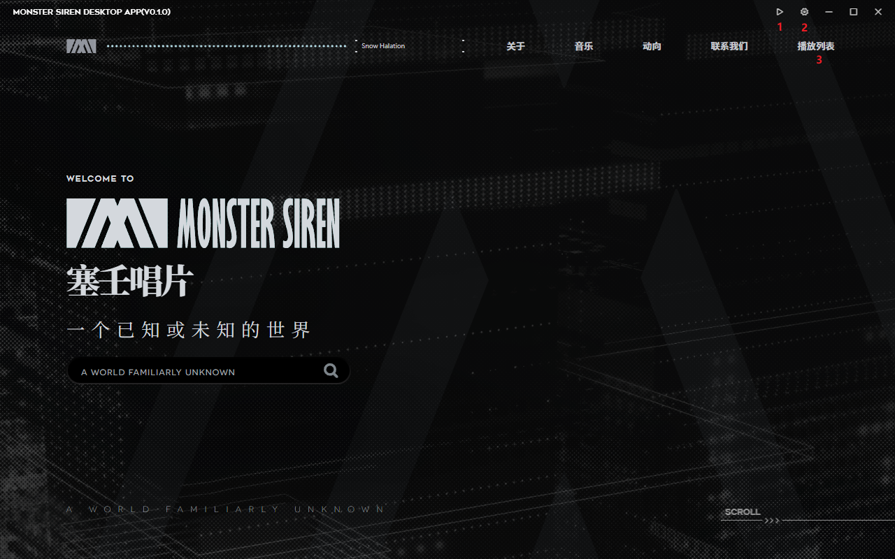

开启软件后界面如下：

对标记进行解释：

- **(1)** 点击后可以快速跳转到播放歌曲页面
- **(2)** 点击后可以展开设置窗口
- **(3)** 点击后可以跳转到播放列表页面

### 软件相比原页面改变了什么？

对页面修改如下：

- 首次点击页面时不会触发歌曲自动播放
- 左上角音频条中歌曲选择列表不再是所有歌曲了，而是当前专辑所有的歌曲
- 原生路由中 `音乐` 页面会插入自定义播放列表，相对来说加载速度可能较慢
- 播放页中歌曲播放时假如歌曲自身包含封面则会替换专辑封面
- 增加了一些自定义页面，位于右上角导航的自定义页面（如播放列表）只能通过鼠标点击到达
- 主页的搜索功能可能无法正常使用
