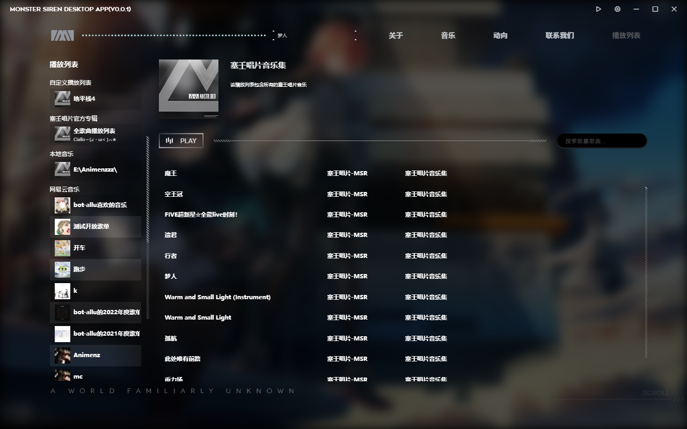

这个播放列表页是一个相对核心的功能，所有自定义 / 定制的播放列表都会在此处和原生页面 `音乐` 下进行展示

接下来将对可操作的功能进行解释

## 各种播放列表

### 塞壬唱片官方专辑

该列表存储所有官方网站的音乐，离线模式下不可用。展示方式可以通过 `设置/基本设置/塞壬唱片播放列表信息细节` 来控制。

建议设置为 `隐藏所有专辑`，因为歌曲与专辑数量实在是太多，如果在本页面使用体验相对较差，建议前往原生路由页面 (即页面上的`音乐`按钮) 进行专辑挑选与欣赏。

### 本地音乐

该列表由 `设置` 内的 `本地音乐` 列表控制

具体见 [添加本地音乐](../local-music)

### 自定义播放列表

该列表暂时没法从设置控制，但是你可以通过在歌曲部分右键菜单新建，然后在左侧播放列表菜单里头移除

### 网易云音乐

## 右键菜单

所有的歌曲都拥有右键菜单，且包含添加到自定义播放列表的选项

要注意的是别在自定义播放列表再往其他歌曲加歌了，没测试过稳定性

左侧播放列表也有右键菜单，其中自定义播放列表可以在这里移除