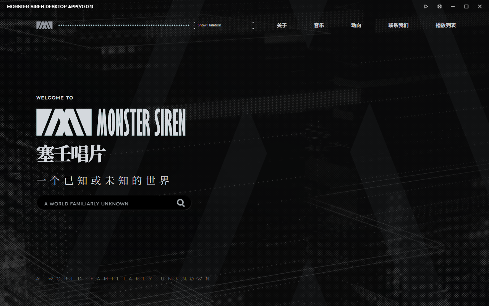
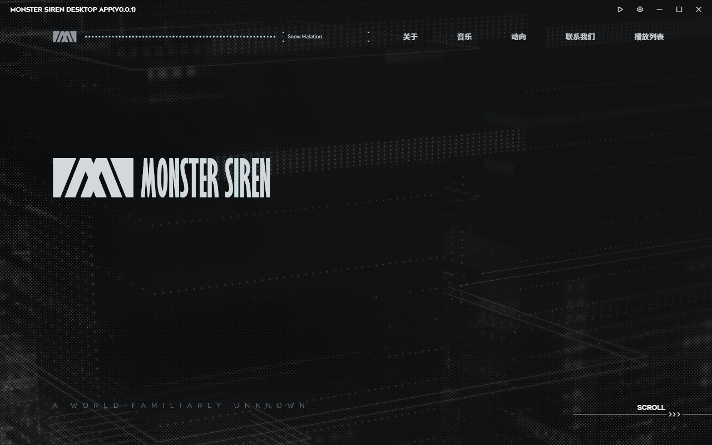

import { FileTree } from '@astrojs/starlight/components';

# 下载软件

可以从 [Github](https://github.com/QingXia-Ela/MonsterSirenDesktop/releases) 下载

一般来说 release 分两个软件：

- MonsterSirenDesktop.exe - 软件本体
- ncm_inject.dll - 网易云插件

首先下载 `MonsterSirenDesktop.exe`，下载完成后可以在你喜欢的地方新建一个文件夹，然后将下载好的软件放入文件夹

假设你的文件夹名字是 `foo`，那么你的目录看起来应该像是这样子：

<FileTree>
- foo/
  - MonsterSirenDesktop.exe **软件本体**
</FileTree>

然后启动软件，你应该可以看到如下页面：

这证明软件启动成功了，接下来可以看看有啥功能可以用了。

## 目前可能遇到的已知问题

有时启动软件发现首页只展示了 Logo 与 Monster Siren 的文字：

这属于偶尔的现象，目前并不知道其问题在哪。此时路由暂时无法启用，但不影响软件正常使用。只需要点击 `播放列表` 页即可恢复正常。
